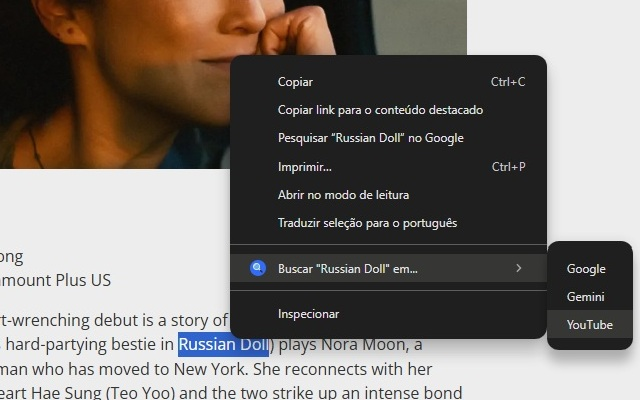

  

<h1 align="center">Context Search Pro</h1>

  A productivity Chrome extension (Manifest V3) built with vanilla JavaScript: Quickly search selected text on Google, Gemini, and YouTube without leaving the page.

  
   
  
  
  

  <a href="#-english">English</a> •
  <a href="#-português">Português</a>

 

<h2 align="center">Visual Demo</h2>

  

---

## English

### About The Project

Context Search Pro is a refined and lightweight productivity extension for Chrome that streamlines your search workflow. It eliminates the need to copy-paste text between tabs by adding a simple and intuitive search menu directly to your right-click context menu.

### Features

-   **Seamless Integration:** Adds a "Search on..." menu directly to your right-click context menu.
-   **Bilingual Support:** Automatically displays in English or Portuguese based on your browser's language.
-   **Core Search Engines:** Quick access to Google, Gemini, and YouTube.
-   **Lightweight & Secure:** Built with minimal permissions, ensuring your privacy and a fast experience.
-   **Modern Platform:** Developed on Manifest V3, the latest and most secure standard for Chrome extensions.

### Installation

The easiest way to install is directly from the Chrome Web Store:

#### Install Locally (for Developers)

1.  Clone or download this repository as a ZIP file.
2.  Open Google Chrome and navigate to `chrome://extensions`.
3.  Enable **"Developer mode"**.
4.  Click on **"Load unpacked"** and select the project folder.

### Built With

<table>
  <tr>
    <td><b>Core Language</b></td>
    <td>Vanilla JavaScript (ES6)</td>
  </tr>
  <tr>
    <td><b>Platform</b></td>
    <td>Chrome Extension APIs (Manifest V3)</td>
  </tr>
    <tr>
    <td><b>Key APIs</b></td>
    <td><code>contextMenus</code>, <code>tabs</code>, <code>storage</code>, <code>i18n</code></td>
  </tr>
</table>

---

## Português

### Sobre o Projeto

O Context Search Pro é uma extensão de produtividade leve e refinada para o Chrome que otimiza seu fluxo de trabalho de pesquisa. Ele elimina a necessidade de copiar e colar texto entre abas ao adicionar um menu de busca simples e intuitivo diretamente ao menu de contexto do botão direito.

### Funcionalidades

-   **Integração Perfeita:** Adiciona um menu "Buscar em..." diretamente ao menu de contexto do botão direito.
-   **Suporte Bilíngue:** Exibe a interface automaticamente em Inglês ou Português com base no idioma do seu navegador.
-   **Buscadores Principais:** Acesso rápido a Google, Gemini e YouTube.
-   **Leve e Segura:** Construída com o mínimo de permissões necessárias, garantindo sua privacidade e uma experiência rápida.
-   **Plataforma Moderna:** Desenvolvida sobre o Manifest V3, o padrão mais recente e seguro para extensões do Chrome.

### Instalação

A forma mais fácil de instalar é diretamente pela Chrome Web Store:

#### Instale Localmente (Para Desenvolvedores)

1.  Clone ou baixe este repositório como um arquivo ZIP.
2.  Abra o Google Chrome e navegue até `chrome://extensions`.
3.  Ative o **"Modo de desenvolvedor"**.
4.  Clique em **"Carregar sem compactação"** e selecione a pasta do projeto.

### Tecnologias Utilizadas

<table>
  <tr>
    <td><b>Linguagem Principal</b></td>
    <td>JavaScript Puro (ES6)</td>
  </tr>
  <tr>
    <td><b>Plataforma</b></td>
    <td>APIs de Extensão do Chrome (Manifest V3)</td>
  </tr>
    <tr>
    <td><b>APIs Utilizadas</b></td>
    <td><code>contextMenus</code>, <code>tabs</code>, <code>storage</code>, <code>i18n</code></td>
  </tr>
</table>

---

### License

Distributed under the MIT License. See `LICENSE` file for more information.

### Author

**Rafael Santos**

